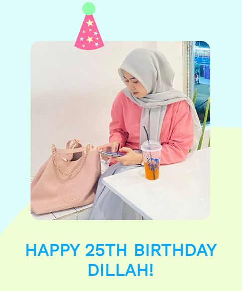

# 🎂 Interactive Birthday Surprise - Dillah's 25th Edition

A beautiful, interactive, and animated birthday greeting web application designed with soft pastel aesthetics and heartfelt messages.

## 🌟 [View the Live Demo](https://halip26.github.io/hbd-dillah/)



---

## ✨ Key Features

- **Interactive Start:** A welcoming "Open Gift" overlay that ensures music starts playing only after user interaction (solving browser autoplay restrictions).
- **Soft Pastel Aesthetic:** A custom-designed color palette (Lavender Blush, Soft Pink, Orchid, and Baby Blue) for a gentle and warm feel.
- **GSAP Animations:** Smooth, professional-grade animations powered by GreenSock Animation Platform.
- **WhatsApp Integration:** A dedicated section for the recipient to reply directly to your WhatsApp with a single click.
- **Fully Responsive:** Optimized for all devices, from desktop to mobile.
- **Custom SEO:** Optimized meta tags for beautiful sharing on social media like WhatsApp, Twitter, and Facebook.

---

## 🛠️ How to Customize

This project is designed to be easily personalizable without deep coding knowledge.

### 1. Edit `customize.json`

Update this file to change the text, name, and image path:

```json
{
  "greeting": "Hi 👋",
  "name": "Dillah",
  "greetingText": "Your humor & good vibes always brighten the day...",
  "imagePath": "./img/dillah.jpg",
  "wishHeading": "Happy 25th Birthday Dillah!",
  ...
}
```

### 2. Change the Music

Replace the file in the `audio/` folder or update the source in `index.html`:

```html
<audio class="song" loop autoplay>
    <source src="./audio/perfect-hbd.mp3"></source>
</audio>
```

### 3. Update the Profile Picture

Place the recipient's photo in the `img/` folder and update the `imagePath` in `customize.json`.

---

## 🚀 Deployment

1. **Fork this repository** to your own GitHub account.
2. **Customize your content** as described above.
3. **Enable GitHub Pages**:
   - Go to your repository **Settings**.
   - Navigate to **Pages** on the left sidebar.
   - Under **Build and deployment**, select the `main` branch and click **Save**.
4. **Share the Joy!** Your site will be live at `https://yourusername.github.io/hbd-dillah/`.

---

## 💡 Built With

- **HTML5 & CSS3**: Structured with semantic HTML and styled with modern CSS features (Flexbox, Keyframes).
- **JavaScript (ES6+)**: Core logic and interactive elements.
- **[GSAP](https://greensock.com/gsap)**: High-performance animations for a premium feel.
- **Responsive Design**: Tailored experience for mobile and desktop users.

---

## 📄 License

This project is open-source and available under the [MIT License](LICENSE).

---

## 📬 Contact & Feedback

Made with 🤍 by [@Halip26](https://github.com/Halip26)

- Email: [halipuddin.angko@gmail.com](mailto:halipuddin.angko@gmail.com)
- Twitter/X: [@halip26](https://x.com/halip26)
